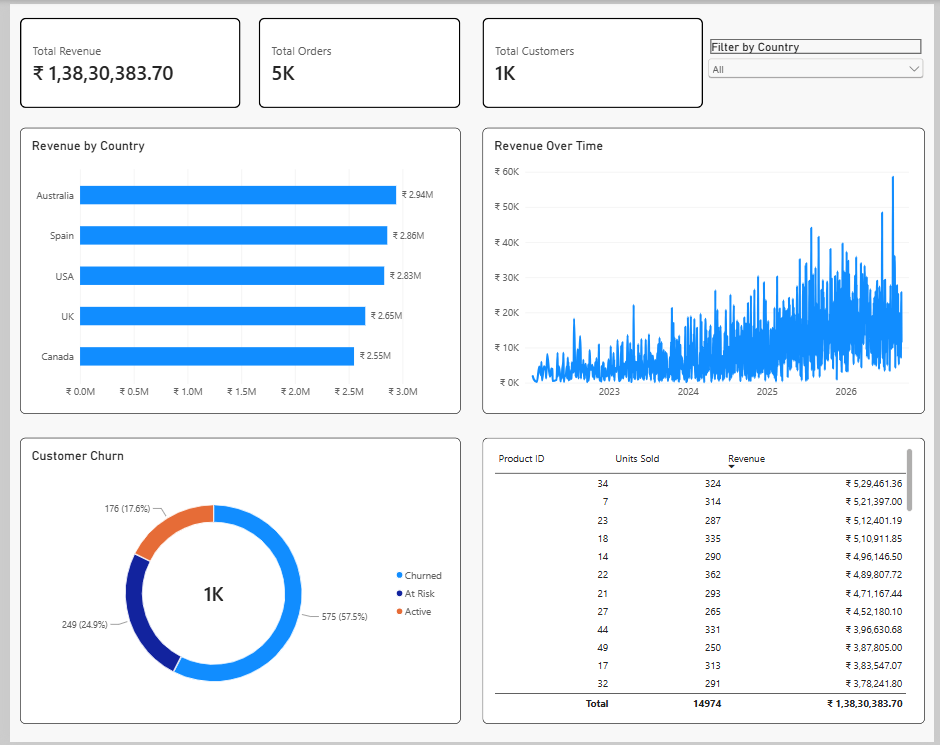
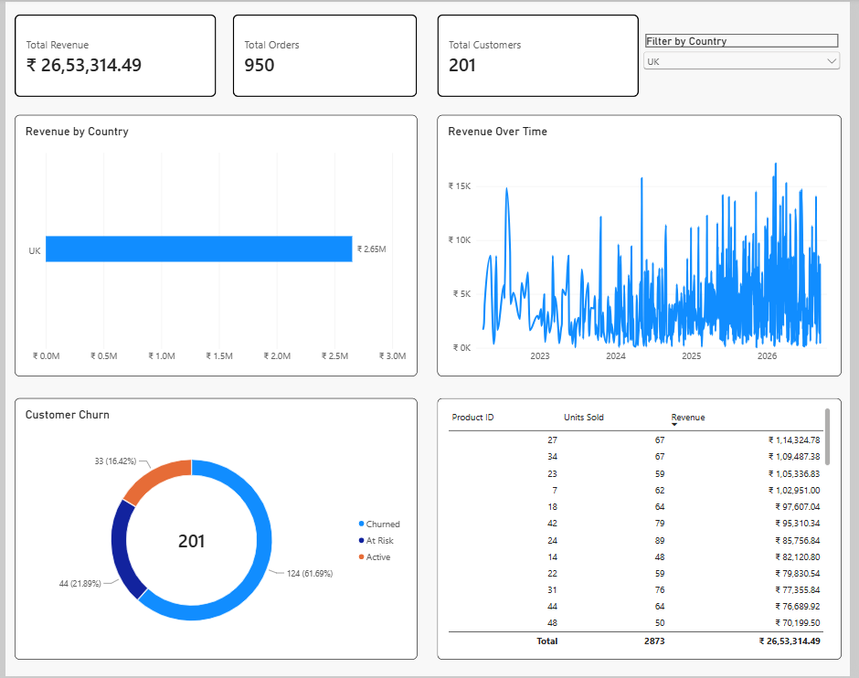

# End-to-End E-Commerce Data Engineering & Business Intelligence Pipeline

An enterprise-grade analytical pipeline and interactive reporting dashboard simulating multi-region e-commerce operations. Built to demonstrate automated synthetic data generation, relational schema design, and production BI visualization standards.

---

## 📊 Live Dashboard & Interactivity Preview

**Global Overview (All Regions):**

**Interactive Cross-Filtering (Regional View):**

---

## 🛠️ Tech Stack
* **Database Management:** MySQL 8.0 (Relational Data Modeling, Foreign Keys, Analytical SQL Views)
* **Data Engineering & Ingestion:** Python, Pandas, SQLAlchemy, PyMySQL, Faker (Automated pipeline populating 5,000+ relational records)
* **Business Intelligence:** Power BI Desktop (16:9 containerized layout, INR currency formatting, star-schema metrics)

---

## 🏗️ Pipeline Architecture

1. **Relational Schema Design (`ecommerce_analysis.sql`):**
   - Engineered normalized tables for `Customers`, `Products`, and `Orders` with strict Foreign Key constraints.
   - Built a consolidated SQL view (`vw_ecommerce_powerbi`) to handle real-time metric aggregations, churn states, and time-series calculations at the database level.

2. **Synthetic Data Pipeline (`generate_ecommerce_data.py`):**
   - Automated script using `Faker` and `NumPy` generating 1,000 customers across global markets, 50 products, and 5,000 sequential orders.
   - Enforced chronological ordering (orders post-dating registration) and mathematical validation (`total = quantity * price`).

3. **Business Intelligence Front-End (`Power BI`):**
   - Built a grid-aligned 16:9 dashboard featuring dynamic regional filters, revenue trends, product performance tables, and customer churn segmentation.

---

## 📈 Key Business Metrics Tracked
* **Total Revenue & Order Volume:** Real-time tracking of GMV and transaction counts.
* **Customer Segmentation:** Cohort mapping for Active, At Risk, and Churned buyers.
* **Regional Performance:** Cross-market comparisons across international territories.
